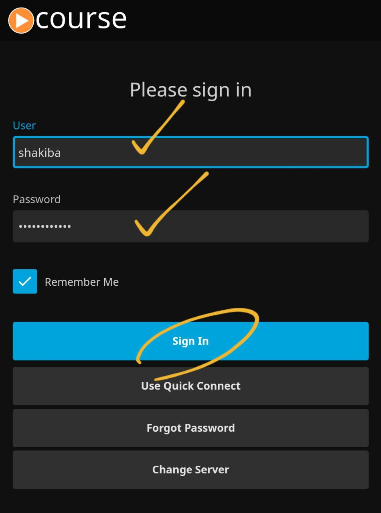

# :material-television-classic:  resource

You can access classes resource on [class.shakiba.net](https://class.shakiba.net/) website.
The username and password will be send to you after 

- defining a roadmap for you
- confirming classes policy by you
- your first payment

The resources content can be accessed by

- any web browser at [class.shakiba.net](https://class.shakiba.net/)
- using [Android app](https://play.google.com/store/apps/details?id=org.jellyfin.mobile)
- using [iOS app](https://apps.apple.com/us/app/jellyfin-mobile/id1480192618)

!!! info
    to login into your account using either Android or iOS, the domain for login
    is `class.shakiba.net`

Please let me know if you found any issues 

### app login

connect to the server

enter your username and password and **sign in**

